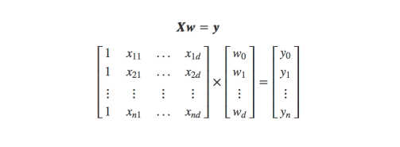

# DEEP LEARNING

### Conceitos básicos:

<b>IA</b> ciência ou engenharia de fazer máquinas inteligêntes.

<b>Machine Learning</b> é a utilização de algoritmos para extrair informações de dados brutos e representá-los através de algum tipo de modelo matemático

<b>GPU</b> Placas gráficas de processamento, que permietm a programação paralela, essencial para o funcionamento das redes 
neurais.

<b>threshold</b> é como se fosse uma parâmetro que pode levar a uma tomada de decisão,
conforme ajustado,para menos ou para mais.(quase como uma tendência)

<b>Big Data</b> Grandes volumes de dados que são utilizados para treinar os modelos e deixá-los mais precisos.

<b>Bias</b> É uma constante multiplicativa ao valor no neuronio matemático.

## O QUE É?

São redes neurais que simulam a mente humana e que, atualmente, vem sendo muito utilizada.
Enfim, é uma sub área de machine learning que, por sua vez, é uma sub área de IA.

Sua evolução deve-se, sobretudo, ao avanço do hardware e do aumento de dados.
Ou seja, o big data e a programação paralela em GPU's, placa gráfica.

Em suma, deep learning é a simulação humana por computadores para reconhecimento de voz, imagens, detecção de doenças e etc

### Redes neurais:

Espelham-se, a grosso modo, na própria rede de neurônios humana.Ou seja, bem como o cerebro
aprende com experiências passadas, a rede neural baseia-se nisso.

Várias camadas de rede neural, isto é, profundas, é chamado deep learning.

### Paralelo entre cérebro humano e redes neurais computacionais

O cérebro humano usa processamento paralelo em massa, ou seja, reconhece imagens , sons e etc,ao msm tempo.
Em computação, redes neurais são um modelo computacional matemático que se baseam na experiência para construir conhecimento.

Como em grafos, as redes neurais simulam conexões sinápticas (região por onde é transmitido impulso elétrico - nervoso)

O neuronio humano é composto pela Soma (meio do corpo), uma calda longa, denominada axônio, ramificações,denominadas dentrítos
e,por fim, terminais nervosos que transmitem informação para outros (sinapse)

Assim, soma e dendritos são a porta de entrada para os neurônios e o axônio a saída

### O modelo matemático de neurônios

Assim como o biológico, o modelo matemático é composto por um componente que pega 
todos os inputs, a média ponderada, e aplica uma função,passando o resultado adiante.

No modelo matemático, são recebidas as entradas e o estimulo varia com o peso, Wk,
é aplicado ,entao, o somatório dos estímulos e,por fim, a função de ativação,que
como no biológico, pode ser ativadora ou inibidora, a depender do sinal dos pesos.

As entradas são multiplicadas pelos pesos, em uma matriz:

Um único neurônio é chamado perceptron.

exemplo de um funcionamento da arquitetura perceptron:

### Funções de ativação

As entradas de um neurônio fazem transformações lineares, já as funções de ativação
fazem transformações não lineares

A grande vantagem dessas funções consistem no fato de que qualquer alteração de bias,
por exemplo, resulte em pequenas alterações no output

Ou seja, elas definem se um neurônio deve ou não ser ativado

Assim, funções de ativação permitem resolver problemas mais complexos, pois, se so houver
bias, haverá apenas regressões lineares que não resolvem problemas difíceis.

### Backpropagation e treinamento de redes neurais

É um algoritmo muito importante para treinar redes neurais profundas.
Ele consiste em 2 passos:

1) Forward pass: as entradas são passadas e as previsões de saída são obtidas
2) Backward pass: calcula-se o gradiente e aplica-se a regra da cadeia para atualizar os pesos
Ou seja, com a taxa de erro, aplica-se as correções e volta para o início do treinamento
### No quesito imagens, a arquitetura de redes convolucionais (CNN) são as mais usadas

Essas redes neurais podem classificar e comparar imagens,identificar rostos e etc
Elas, por sua vez, processam imagens como tensores (matrizes).
Para analisar imagens, essas redes percebem como volumes, objetos tridimencionais, em
vez de estruturas planas a serem medidas por largura e altura.

Assim, elas recebem a imagem como um retângulo cujo dimensões, largura e altura,
são o número de pixels e cujo profundidade representa cada letra do RGB.

Feito isso, é representado várias matrizes de múltiplas dimensões e calculado várias
probabilidades para gerar uma única saída.

O que é aprendido, no treinamento, são o peso e o bias,assim , cada camada de convolução
aprendem diferentes detalhes da imagem, cores, formas, tamanhos etc

### PROJETO

Identificar o vegetal passado como imagem e apresentar o resultado
podendo auxiliar na agricultura com a identificação de vegetação
 e, auxiliar, viajantes, a respeito do vegetal e seu nome

### obs: o processo é bastante pesado e demorado, ao rodar pela primeira vez

BIGDATA extraído de: https://www.kaggle.com/datasets/moltean/fruits

execução:

